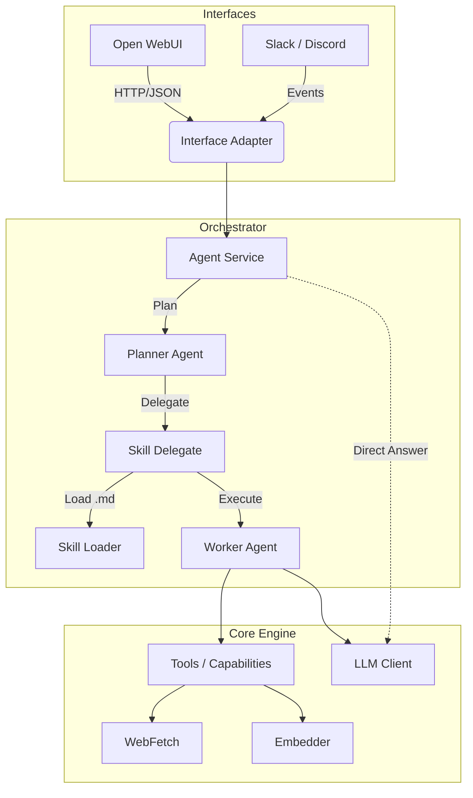

# Architecture

The AI Agent Platform follows a **3-layer "Universal Agent" architecture**, designed to separate protocol handling, orchestration, and core execution. This ensures that the agent can be accessed via multiple interfaces (OpenWebUI, Slack, CLI) while maintaining a consistent skill execution logic.



## Layers & Dependency Rules

The system follows a **Modular Monolith** architecture with a strict unidirectional dependency flow.

**Directory Structure & Rules (`services/agent/src/`):**

1.  **`interfaces/`** (Top Level)
    *   *Purpose:* HTTP API, CLI, Event consumers. Adapts external protocols to internal data structures.
    *   *Rule:* Can import everything below (`orchestrator`, `modules`, `core`). **NO Business Logic here.**

2.  **`orchestrator/`**
    *   *Purpose:* Workflows, Task Delegation. Contains the Planner Agent and Skill delegation logic.
    *   *Rule:* Can import `modules` and `core`.

3.  **`modules/`**
    *   *Purpose:* Isolated features (RAG, Indexer, Embedder).
    *   *Rule:* Encapsulated. Can **ONLY** import `core`. **Cannot** import other modules.

4.  **`core/`** (Bottom Level)
    *   *Purpose:* Database, Models, Config, Observability. The execution runtime.
    *   *Rule:* **NEVER** import from `interfaces`, `orchestrator`, or `modules`.

---

## Protocol-Based Dependency Injection

The `core/` layer uses **Protocol classes** to define interfaces, enabling dependency injection without importing from higher layers.

### Protocols (`core/protocols/`)

| Protocol | Purpose |
|----------|---------|
| `EmbedderProtocol` | Text embedding interface |
| `MemoryProtocol` | Vector memory store interface |
| `LLMProtocol` | LLM client interface |
| `ToolProtocol` | Tool execution interface |

### Providers (`core/providers.py`)

Runtime implementations are injected via providers:

```python
from core.providers import (
    get_embedder,
    get_memory_store,
    get_tool_registry,
)

# In startup (app.py)
embedder = get_embedder()
memory = get_memory_store(embedder)
```

### Wiring at Startup

All dependency injection happens in `core/core/app.py` during the FastAPI lifespan event:

```python
@contextlib.asynccontextmanager
async def lifespan(app: FastAPI):
    embedder = get_embedder()
    memory = get_memory_store(embedder)
    tool_registry = get_tool_registry()
    # ... inject into services
```

---

## Adaptive Execution

The agent uses an **Adaptive Execution** pattern where step outputs are semantically evaluated and the system can self-correct by re-planning.

### Step Supervisor (`core/agents/supervisor_step.py`)

After each step execution, `StepSupervisorAgent` uses an LLM to evaluate:
- **Empty Results**: Did the step return nothing useful?
- **Hidden Errors**: Are there error messages in the output text?
- **Intent Mismatch**: Does the output address the step's goal?

Returns: `{"decision": "ok" | "adjust", "reason": "..."}`

### Re-planning Loop

If `decision == "adjust"`:
1. Feedback is injected into conversation history
2. Execution halts and Planner generates a new plan
3. Safety limit: max 3 re-plans to prevent infinite loops

---

## Observability

### Structured Error Codes (`core/observability/error_codes.py`)

Standardized error codes for AI agent self-diagnosis:

| Category | Examples |
|----------|----------|
| `TOOL_*` | NOT_FOUND, EXECUTION_FAILED, TIMEOUT |
| `LLM_*` | CONNECTION_FAILED, RATE_LIMITED |
| `DB_*` | CONNECTION_FAILED, QUERY_FAILED |
| `NET_*` | CONNECTION_REFUSED, TIMEOUT |
| `RAG_*` | QDRANT_UNAVAILABLE, COLLECTION_NOT_FOUND |

### Machine-Readable Diagnostics

**Endpoint:** `GET /diagnostics/summary`

Returns AI-optimized health report with:
- `overall_status`: HEALTHY | DEGRADED | CRITICAL
- `failed_components`: List with error codes and recovery hints
- `recommended_actions`: Prioritized list of fixes

---

## Skill System

Skills are defined as **Markdown files** with YAML Frontmatter, located in the `skills/` directory.

*   **Definition**: A skill wraps a prompt template, execution parameters, and **allowed tools**.
*   **Discovery**: The `SkillLoader` scans `skills/` at startup.
*   **Execution**: The `Planner Agent` delegates tasks to skills via the `consult_expert` tool. Each skill runs as an isolated Worker Agent loop.

For detailed skill format, see [SKILLS_FORMAT.md](SKILLS_FORMAT.md).

---

## Testing

### Test Pyramid

| Level | Type | Purpose |
|-------|------|---------|
| 1 | Unit Tests | Fast, mocked dependencies |
| 2 | Integration Tests | Real database, mocked LLM |
| 3 | Semantic Tests | Golden master responses |

### Key Test Files

| File | Coverage |
|------|----------|
| `test_skill_delegate.py` | Skill execution flow |
| `test_openwebui_adapter.py` | HTTP adapter formatting |
| `test_error_codes.py` | Error classification |
| `test_agent_scenarios.py` | End-to-end flows |
| `mocks.py` | `MockLLMClient`, `InMemoryAsyncSession` |

### Running Tests

```bash
# Unit tests only
python -m pytest services/agent/src/

# Full quality check
python scripts/code_check.py
```