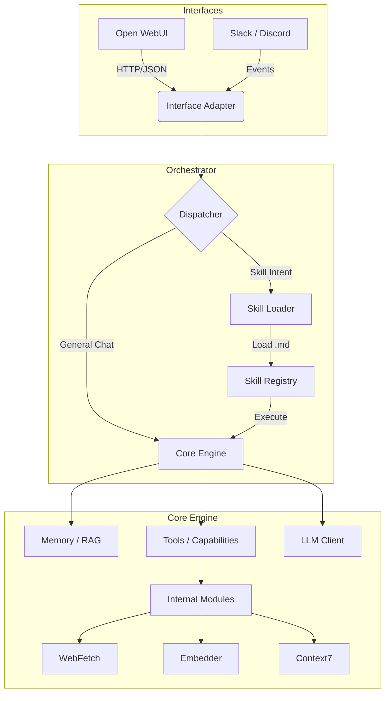

# Architecture

The AI Agent Platform follows a **3-layer "Universal Agent" architecture**, designed to separate protocol handling, orchestration, and core execution. This ensures that the agent can be accessed via multiple interfaces (OpenWebUI, Slack, CLI) while maintaining a consistent skill execution logic.

## Layers

1.  **Interface Layer (`src/interfaces`)**:
    *   Adapts external protocols to internal data structures.
    *   Handles authentication, request validation, and response formatting.
    *   Example: `src/interfaces/http/openwebui_adapter.py` converts OpenAI-compatible requests into internal `AgentRequest` objects.

2.  **Orchestrator Layer (`src/orchestrator`)**:
    *   Manages the "Brain" of the agent.
    *   **Dispatcher**: Decides whether a user message is a command (Skill) or a conversation (General Chat).
    *   **Skill Loader**: Scans and loads file-based capabilities from the `skills/` directory.

3.  **Core Engine (`src/core`)**:
    *   The execution runtime.
    *   Manages LLM interactions (via LiteLLM).
    *   Handles Tool calling, Memory retrieval (RAG), and State management.

## Skill System

Skills are defined as **Markdown files** with YAML Frontmatter, located in the `skills/` directory.

*   **Definition**: A skill wraps a prompt template and execution parameters.
*   **Discovery**: The `SkillLoader` scans `skills/` at startup.
*   **Routing**: The `Dispatcher` matches user input against skill triggers (e.g., explicit commands like `/briefing` or semantic intent).

For detailed skill format, see [SKILLS_FORMAT.md](SKILLS_FORMAT.md).