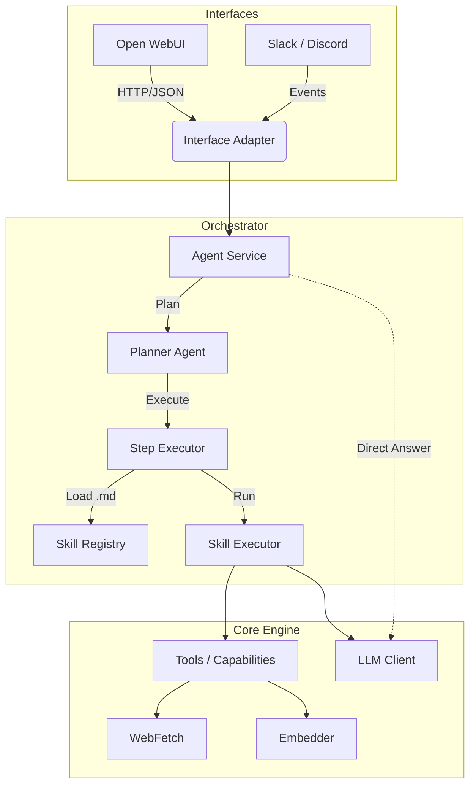

# Architecture

The AI Agent Platform follows a **3-layer "Universal Agent" architecture**, designed to separate protocol handling, orchestration, and core execution. This ensures that the agent can be accessed via multiple interfaces (OpenWebUI, Slack, CLI) while maintaining a consistent skill execution logic.



## Layers & Dependency Rules

The system follows a **Modular Monolith** architecture with a strict unidirectional dependency flow.

**Directory Structure & Rules (`services/agent/src/`):**

1.  **`interfaces/`** (Top Level)
    *   *Purpose:* HTTP API, CLI, Event consumers. Adapts external protocols to internal data structures.
    *   *Rule:* Can import everything below (`orchestrator`, `modules`, `core`). **NO Business Logic here.**

2.  **`orchestrator/`**
    *   *Purpose:* Workflows, Task Delegation. Contains the Planner Agent and Skill delegation logic.
    *   *Rule:* Can import `modules` and `core`.

3.  **`modules/`**
    *   *Purpose:* Isolated features (RAG, Indexer, Embedder).
    *   *Rule:* Encapsulated. Can **ONLY** import `core`. **Cannot** import other modules.

4.  **`core/`** (Bottom Level)
    *   *Purpose:* Database, Models, Config, Observability. The execution runtime.
    *   *Rule:* **NEVER** import from `interfaces`, `orchestrator`, or `modules`.

---

## Multi-Tenant Architecture

The platform implements **user and context-based multi-tenancy** for complete isolation between users, workspaces, or projects.

### Data Model

**User Model:**
```python
class User(Base):
    __tablename__ = "users"

    id: Mapped[int] = mapped_column(primary_key=True)
    email: Mapped[str] = mapped_column(String(255), unique=True, index=True)  # Normalized lowercase
    name: Mapped[str] = mapped_column(String(255))
    role: Mapped[str] = mapped_column(String(50), default="user")  # "user" or "admin"
    created_at: Mapped[datetime] = mapped_column(default=datetime.utcnow)
    updated_at: Mapped[datetime] = mapped_column(default=datetime.utcnow, onupdate=datetime.utcnow)

    # Relationships
    contexts: Mapped[list["Context"]] = relationship(secondary="user_contexts", back_populates="users")
    credentials: Mapped[list["UserCredential"]] = relationship(back_populates="user", cascade="all, delete-orphan")
```

**Context Model:**
```python
class Context(Base):
    __tablename__ = "contexts"

    id: Mapped[UUID] = mapped_column(primary_key=True, default=uuid.uuid4)
    name: Mapped[str] = mapped_column(String(255), unique=True, index=True)
    type: Mapped[str] = mapped_column(String(50))
    config: Mapped[dict] = mapped_column(JSONB, default=dict)
    default_cwd: Mapped[str] = mapped_column(String(500))
    created_at: Mapped[datetime] = mapped_column(default=datetime.utcnow)

    # Relationships
    users: Mapped[list["User"]] = relationship(secondary="user_contexts", back_populates="contexts")
    conversations: Mapped[list["Conversation"]] = relationship(back_populates="context", cascade="all, delete-orphan")
    oauth_tokens: Mapped[list["OAuthToken"]] = relationship(back_populates="context", cascade="all, delete-orphan")
```

**UserCredential Model:**
```python
class UserCredential(Base):
    __tablename__ = "user_credentials"

    id: Mapped[int] = mapped_column(primary_key=True)
    user_id: Mapped[int] = mapped_column(ForeignKey("users.id"), index=True)
    credential_type: Mapped[str] = mapped_column(String(50))  # azure_devops_pat, github_token, etc.
    encrypted_value: Mapped[bytes] = mapped_column(LargeBinary)  # Fernet encrypted
    created_at: Mapped[datetime] = mapped_column(default=datetime.utcnow)
    updated_at: Mapped[datetime] = mapped_column(default=datetime.utcnow, onupdate=datetime.utcnow)

    # Relationships
    user: Mapped["User"] = relationship(back_populates="credentials")

    # Unique constraint
    __table_args__ = (UniqueConstraint("user_id", "credential_type"),)
```

### User Auto-Provisioning

Users are automatically created on first login when Open WebUI forwards authentication headers:

```python
async def get_or_create_user(identity: UserIdentity, session: AsyncSession) -> User:
    # Normalize email to lowercase
    email = identity.email.lower().strip()

    # Check if user exists
    stmt = select(User).where(User.email == email)
    result = await session.execute(stmt)
    user = result.scalar_one_or_none()

    if user:
        # Update last login and display name (NOT role - see security note)
        user.last_login_at = datetime.now(UTC)
        if identity.name and user.display_name != identity.name:
            user.display_name = identity.name
        # SECURITY: Do NOT sync role from headers - database role is authoritative.
        # Header role claims could be spoofed. Role changes must be done by admins
        # through the admin portal, not automatically from SSO headers.
        await session.flush()
        return user

    # Create new user with role from headers (initial provisioning only)
    user = User(email=email, display_name=identity.name, role=identity.role)
    session.add(user)
    await session.flush()
    # ... create personal context and link ...
    return user
```

**Security Note:** After initial user creation, role is NEVER updated from headers. The database role is authoritative. This prevents privilege escalation via header spoofing.

### Credential Encryption

User credentials are encrypted using Fernet symmetric encryption:

```python
from cryptography.fernet import Fernet

# Initialize cipher with key from environment
encryption_key = os.getenv("AGENT_CREDENTIAL_ENCRYPTION_KEY")
cipher = Fernet(encryption_key.encode())

# Encrypt credential
encrypted_value = cipher.encrypt(credential_value.encode())

# Decrypt credential
decrypted_value = cipher.decrypt(encrypted_value).decode()
```

**Security:**
- Encryption key must be 32 URL-safe base64-encoded bytes
- Generate key: `python -c "from cryptography.fernet import Fernet; print(Fernet.generate_key().decode())"`
- Store key securely (environment variable, secrets manager)
- Losing the key makes all credentials unrecoverable

### Service Factory Pattern

Instead of a global `AgentService` singleton, the `ServiceFactory` creates isolated services per request:

```python
# Per-request service creation (not singleton!)
@app.post("/v1/agent")
async def run_agent(
    request: AgentRequest,
    factory: ServiceFactory = Depends(get_service_factory),
    session: AsyncSession = Depends(get_db),
):
    # Extract context_id from conversation
    context_id = await extract_context_id(request, session)

    # Create context-scoped service
    service = await factory.create_service(context_id, session)

    # Each service has:
    # - Cloned tool registry (filtered by permissions)
    # - Context-filtered memory store
    # - OAuth-authenticated MCP clients
    return await service.handle_request(request, session)
```

### Context Isolation

**Database Level:**
- Conversations, OAuth tokens, and tool permissions scoped to `context_id`
- Cascade delete ensures data cleanup

**Memory Level (Qdrant):**
- Every memory point tagged with `context_id`
- Searches automatically filtered by context

**MCP Clients:**
- Per-context OAuth tokens
- Client pool manages connections per context
- Health monitoring and automatic reconnection

**Tool Registry:**
- Base registry cloned per request
- Per-context permissions applied
- MCP tools loaded with context-specific OAuth

See [Multi-Tenant Architecture](./MULTI_TENANT_ARCHITECTURE.md) for details.

### Admin API

The platform includes admin endpoints for managing users, contexts, credentials, OAuth tokens, and MCP clients:

```bash
# Context management
GET /admin/contexts
POST /admin/contexts
DELETE /admin/contexts/{context_id}

# Credential management
GET /admin/credentials/
POST /admin/credentials/
DELETE /admin/credentials/{credential_id}

# OAuth token management
GET /admin/oauth/tokens
DELETE /admin/oauth/tokens/{token_id}

# MCP client management
GET /admin/mcp/health
POST /admin/mcp/disconnect/{context_id}
```

All admin endpoints require Entra ID authentication forwarded from Open WebUI with admin role.

See [Admin API Reference](./ADMIN_API.md) for complete documentation.

---

## Protocol-Based Dependency Injection

The `core/` layer uses **Protocol classes** to define interfaces, enabling dependency injection without importing from higher layers.

### Protocols (`core/protocols/`)

| Protocol | Purpose |
|----------|---------|
| `EmbedderProtocol` | Text embedding interface |
| `MemoryProtocol` | Vector memory store interface |
| `LLMProtocol` | LLM client interface |
| `ToolProtocol` | Tool execution interface |

### Providers (`core/providers.py`)

Runtime implementations are injected via providers:

```python
from core.providers import (
    get_embedder,
    get_memory_store,
    get_tool_registry,
)

# In startup (app.py)
embedder = get_embedder()
memory = get_memory_store(embedder)
```

### Wiring at Startup

All dependency injection happens in `core/core/app.py` during the FastAPI lifespan event:

```python
@contextlib.asynccontextmanager
async def lifespan(app: FastAPI):
    embedder = get_embedder()
    memory = get_memory_store(embedder)
    tool_registry = get_tool_registry()
    # ... inject into services
```

---

## Adaptive Execution

The agent uses an **Adaptive Execution** pattern where step outputs are semantically evaluated and the system can self-correct via retry and re-planning.

### StepOutcome (4-Level Decision System)

After each step execution, `StepSupervisorAgent` evaluates the result and returns a `StepOutcome`:

| Outcome | Meaning | Action |
|---------|---------|--------|
| `SUCCESS` | Step completed | Proceed to next step |
| `RETRY` | Transient error | Retry same step with feedback (max 1 retry) |
| `REPLAN` | Step failed | Generate new plan |
| `ABORT` | Critical failure | Stop execution entirely |

### Self-Correction Loop

1. **Step Executes** via SkillExecutor or StepExecutorAgent
2. **Supervisor Reviews** the output
3. **Based on Outcome**:
   - `SUCCESS`: Move to next step
   - `RETRY` (first attempt): Retry with feedback injected
   - `RETRY` (max reached) or `REPLAN`: Generate new plan
   - `ABORT`: Stop with error

Safety limits:
- Max 1 retry per step (self-correction)
- Max 3 re-plans total (prevent infinite loops)

---

## Observability

### Structured Error Codes (`core/observability/error_codes.py`)

Standardized error codes for AI agent self-diagnosis:

| Category | Examples |
|----------|----------|
| `TOOL_*` | NOT_FOUND, EXECUTION_FAILED, TIMEOUT |
| `LLM_*` | CONNECTION_FAILED, RATE_LIMITED |
| `DB_*` | CONNECTION_FAILED, QUERY_FAILED |
| `NET_*` | CONNECTION_REFUSED, TIMEOUT |
| `RAG_*` | QDRANT_UNAVAILABLE, COLLECTION_NOT_FOUND |

### Machine-Readable Diagnostics

**Endpoint:** `GET /diagnostics/summary`

Returns AI-optimized health report with:
- `overall_status`: HEALTHY | DEGRADED | CRITICAL
- `failed_components`: List with error codes and recovery hints
- `recommended_actions`: Prioritized list of fixes

---

## Skills-Native Execution

Skills are the **primary execution unit** in the agent architecture. They are defined as Markdown files with YAML frontmatter in the `skills/` directory.

### Architecture Components

| Component | Purpose |
|-----------|---------|
| `SkillRegistry` | Validates all skills at startup, checks tool references |
| `SkillExecutor` | Runs skills with scoped tool access |
| `Skill` | Dataclass representing a loaded skill |

### Skill Definition

```yaml
---
name: researcher
description: Web research skill
tools:
  - web_search
  - fetch_url
model: agentchat
max_turns: 5
---
You are a research assistant. Find information about: $ARGUMENTS
```

### Execution Flow

```
Plan Step (executor="skill", action="skill", tool="researcher")
    ↓
SkillRegistry.get("researcher")
    ↓
SkillExecutor.execute_stream()
    ↓
Build scoped tool set (ONLY tools in skill.tools)
    ↓
Run LLM tool-calling loop with skill.model
    ↓
Yield streaming events (thinking, content, result)
```

### Security: Scoped Tool Access

Skills can **ONLY** access tools explicitly listed in their frontmatter. This provides:

- **Isolation**: Each skill has limited capabilities
- **Security**: Tools aren't directly exposed to the LLM
- **Clarity**: Clear capability boundaries per skill

For detailed skill format, see [SKILLS_FORMAT.md](SKILLS_FORMAT.md).

---

## Testing

### Test Pyramid

| Level | Type | Purpose |
|-------|------|---------|
| 1 | Unit Tests | Fast, mocked dependencies |
| 2 | Integration Tests | Real database, mocked LLM |
| 3 | Semantic Tests | Golden master responses |

### Key Test Files

| File | Coverage |
|------|----------|
| `test_skill_registry.py` | Skill registration and lookup |
| `test_openwebui_adapter.py` | HTTP adapter formatting |
| `test_error_codes.py` | Error classification |
| `test_agent_scenarios.py` | End-to-end flows |
| `mocks.py` | `MockLLMClient`, `InMemoryAsyncSession` |

### Running Tests

```bash
# Unit tests only
python -m pytest services/agent/src/

# Full quality check (lint, format, typecheck, test)
./stack check

# Fast linting and formatting only
./stack lint

# Type checking only
./stack typecheck

# Tests only
./stack test

# CI mode (no auto-fix)
./stack check --no-fix
```