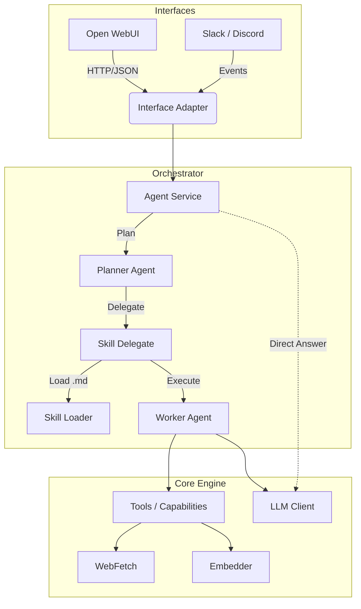

# Architecture

The AI Agent Platform follows a **3-layer "Universal Agent" architecture**, designed to separate protocol handling, orchestration, and core execution. This ensures that the agent can be accessed via multiple interfaces (OpenWebUI, Slack, CLI) while maintaining a consistent skill execution logic.

## Layers & Dependency Rules

The system follows a **Modular Monolith** architecture with a strict unidirectional dependency flow.

**Directory Structure & Rules (`services/agent/src/`):**

1.  **`interfaces/`** (Top Level)
    *   *Purpose:* HTTP API, CLI, Event consumers. Adapts external protocols to internal data structures.
    *   *Rule:* Can import everything below (`orchestrator`, `modules`, `core`). **NO Business Logic here.**

2.  **`orchestrator/`**
    *   *Purpose:* Workflows, Task Delegation. Contains the Planner Agent and Skill delegation logic.
    *   *Rule:* Can import `modules` and `core`.

3.  **`modules/`**
    *   *Purpose:* Isolated features (RAG, Indexer, Embedder).
    *   *Rule:* Encapsulated. Can **ONLY** import `core`. **Cannot** import other modules.

4.  **`core/`** (Bottom Level)
    *   *Purpose:* Database, Models, Config, Observability. The execution runtime.
    *   *Rule:* **NEVER** import from `interfaces`, `orchestrator`, or `modules`.

## Skill System

Skills are defined as **Markdown files** with YAML Frontmatter, located in the `skills/` directory.

*   **Definition**: A skill wraps a prompt template, execution parameters, and **allowed tools**.
*   **Discovery**: The `SkillLoader` scans `skills/` at startup.
*   **Execution**: The `Planner Agent` delegates tasks to skills via the `consult_expert` tool. Each skill runs as an isolated Worker Agent loop.

For detailed skill format, see [SKILLS_FORMAT.md](SKILLS_FORMAT.md).