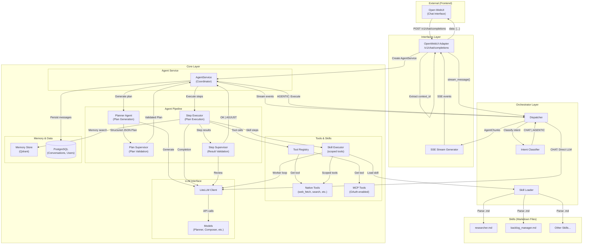
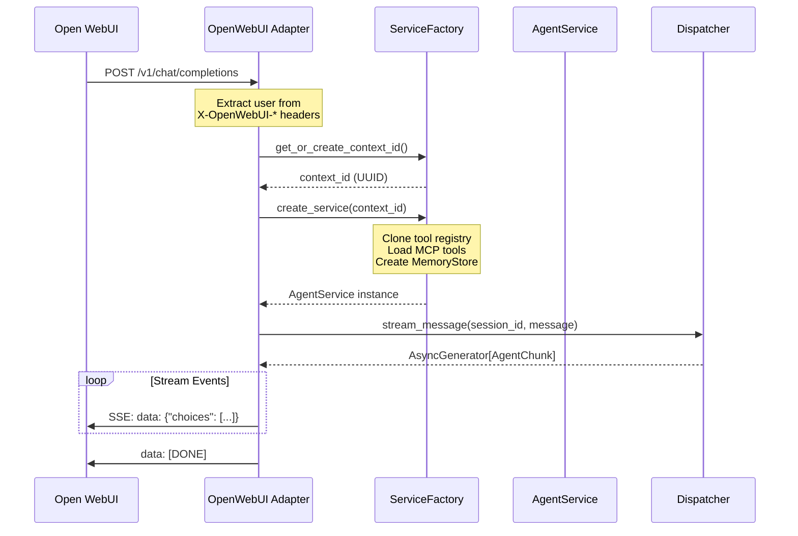
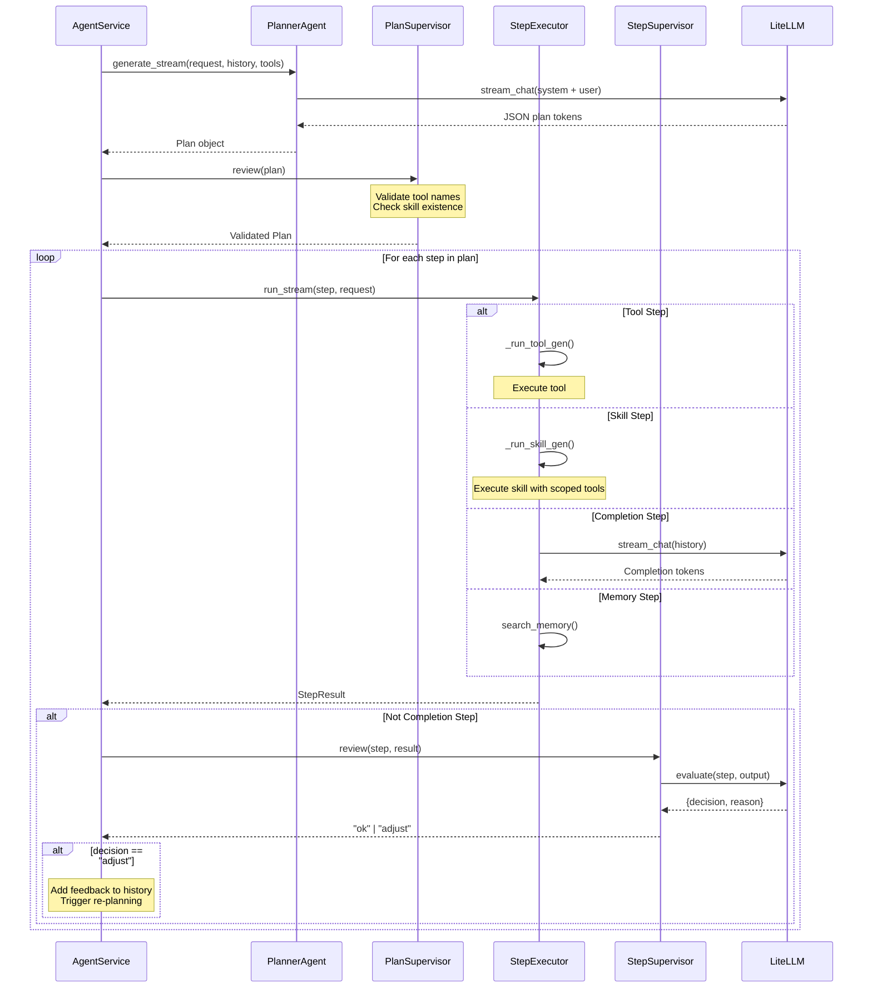
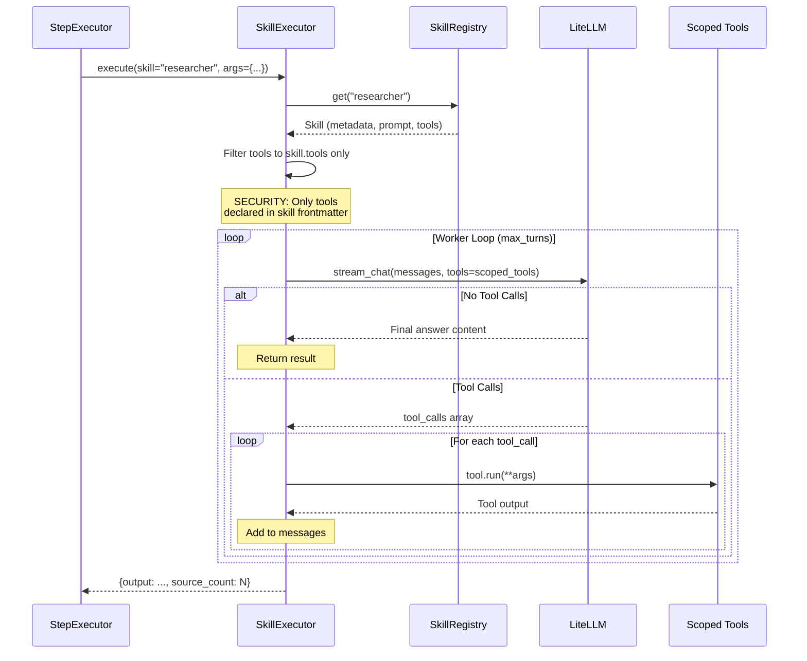
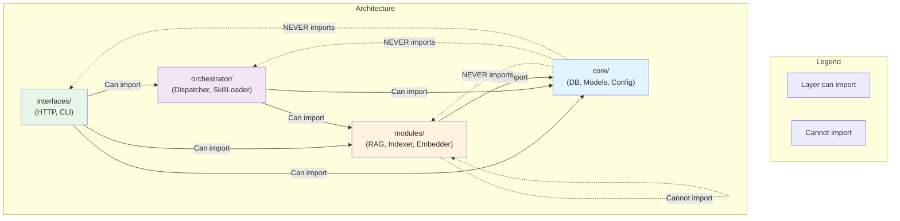
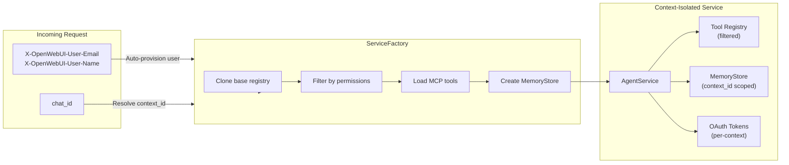
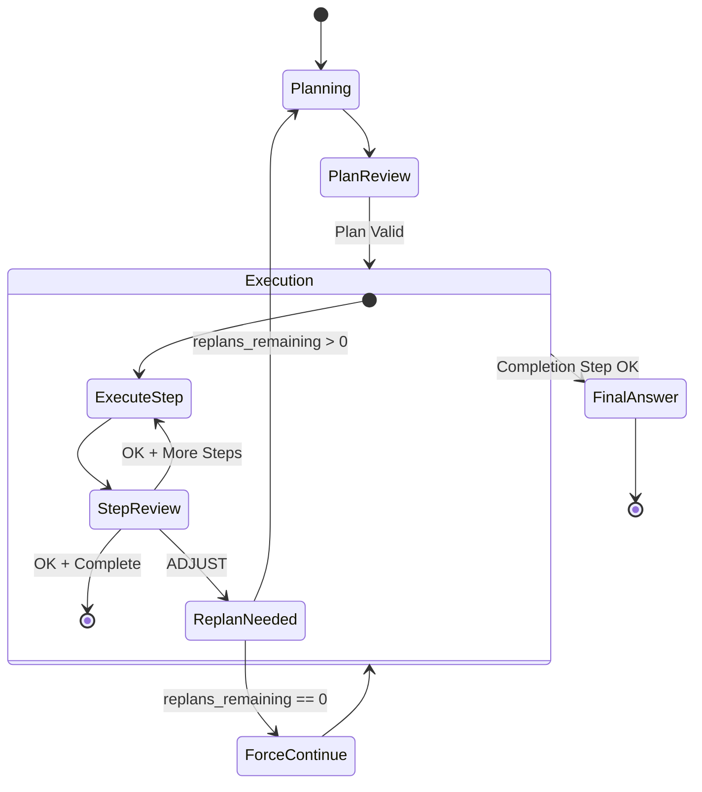

# Platform Architecture

This document provides a detailed view of the AI Agent Platform's architecture, showing how requests flow from Open WebUI through the system and how components interact.

## Component Overview

| Component | Layer | Purpose |
|-----------|-------|---------|
| **Open WebUI** | External | Chat frontend that sends OpenAI-compatible API requests |
| **OpenWebUI Adapter** | Interfaces | Translates HTTP requests to internal format, handles SSE streaming |
| **Dispatcher** | Orchestrator | Routes requests based on intent classification (chat vs agentic) |
| **AgentService** | Core | Coordinates planning, execution, and memory operations |
| **PlannerAgent** | Core/Agents | Generates execution plans from user requests |
| **PlanSupervisor** | Core/Agents | Validates plans before execution |
| **StepExecutor** | Core/Agents | Executes individual plan steps |
| **StepSupervisor** | Core/Agents | Validates step results, triggers re-planning if needed |
| **SkillExecutor** | Core/Skills | Executes skills with scoped tool access |
| **ToolRegistry** | Core/Tools | Manages available tools per context |
| **MemoryStore** | Core | Vector-based memory for context retrieval |
| **LiteLLMClient** | Core | Unified interface to multiple LLM providers |

---

## Request Flow Diagram

---

## Detailed Component Interactions

### 1. Request Entry Point

### 2. Planning and Execution Pipeline

### 3. Skill Execution

---

## Layer Dependency Rules

---

## Multi-Tenant Context Isolation

---

## Adaptive Execution Loop

The system supports re-planning when step execution fails validation:

---

## Key Event Types

The system uses typed events for streaming responses:

| Event Type | Description | When Emitted |
|------------|-------------|--------------|
| `thinking` | Internal reasoning/status | Plan generation, step transitions |
| `plan` | Execution plan created | After PlannerAgent completes |
| `step_start` | Step execution beginning | Before each step runs |
| `tool_start` | Tool call beginning | When tool is invoked |
| `tool_output` | Tool execution result | After tool completes |
| `skill_activity` | Skill worker activity | During skill execution (search, fetch) |
| `content` | Response content | Final answer tokens |
| `error` | Error occurred | On failures |
| `history_snapshot` | Conversation state | After completion |

---

## File Locations

| Component | File Path |
|-----------|-----------|
| OpenWebUI Adapter | `services/agent/src/interfaces/http/openwebui_adapter.py` |
| Dispatcher | `services/agent/src/orchestrator/dispatcher.py` |
| AgentService | `services/agent/src/core/core/service.py` |
| ServiceFactory | `services/agent/src/core/core/service_factory.py` |
| PlannerAgent | `services/agent/src/core/agents/planner.py` |
| StepExecutor | `services/agent/src/core/agents/executor.py` |
| StepSupervisor | `services/agent/src/core/agents/supervisor_step.py` |
| PlanSupervisor | `services/agent/src/core/agents/supervisor_plan.py` |
| SkillRegistry | `services/agent/src/core/skills/registry.py` |
| SkillExecutor | `services/agent/src/core/skills/executor.py` |
| ToolRegistry | `services/agent/src/core/tools/registry.py` |
| SkillLoader | `services/agent/src/orchestrator/skill_loader.py` |
| LiteLLMClient | `services/agent/src/core/core/litellm_client.py` |
| MemoryStore | `services/agent/src/core/core/memory.py` |

---

## Summary

The AI Agent Platform follows a clean 4-layer architecture:

1. **Interfaces** - Protocol adapters (HTTP/SSE for Open WebUI)
2. **Orchestrator** - Request routing and skill management
3. **Core** - Execution engine with planning, supervision, and tools
4. **Modules** - Isolated feature modules (RAG, Indexer, Embedder)

Requests flow from Open WebUI through the adapter, get classified by intent, and either:
- **CHAT**: Direct LLM response
- **AGENTIC**: Full planning/execution pipeline with tool use and adaptive re-planning

The system provides multi-tenant isolation through context-scoped services, ensuring each user's data and tools remain separate.
