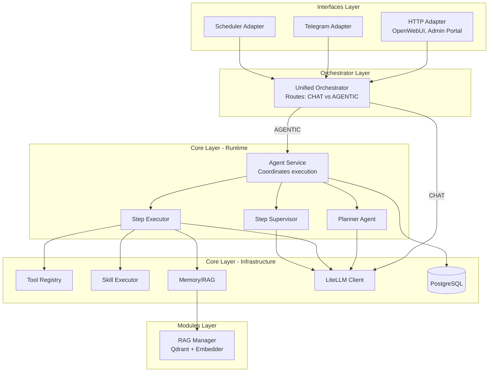
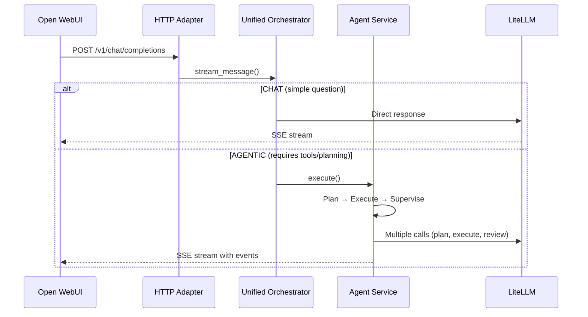
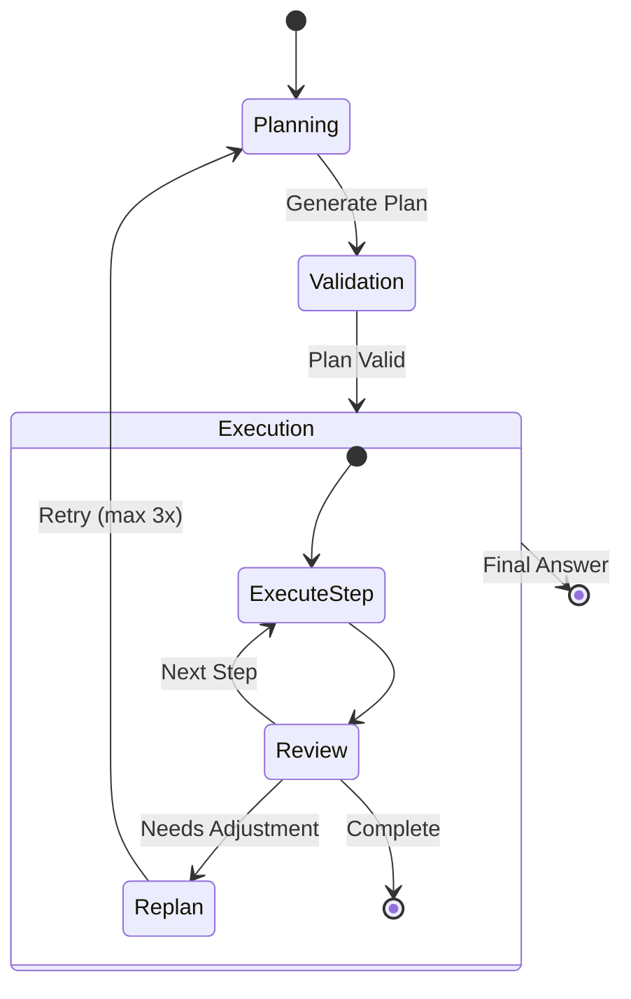
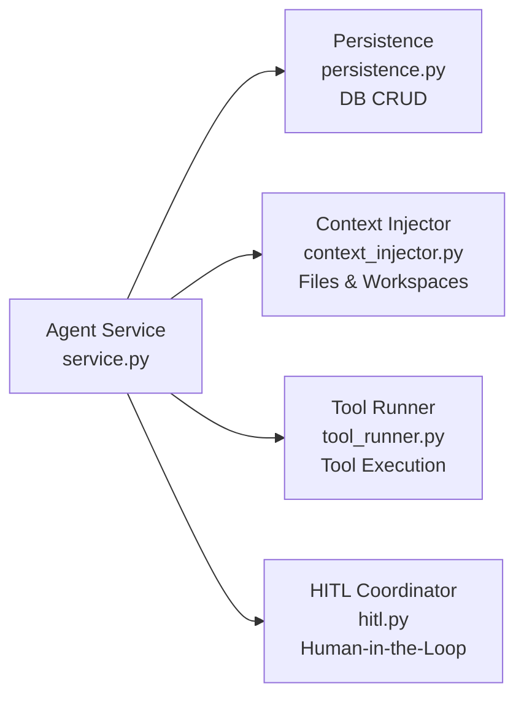
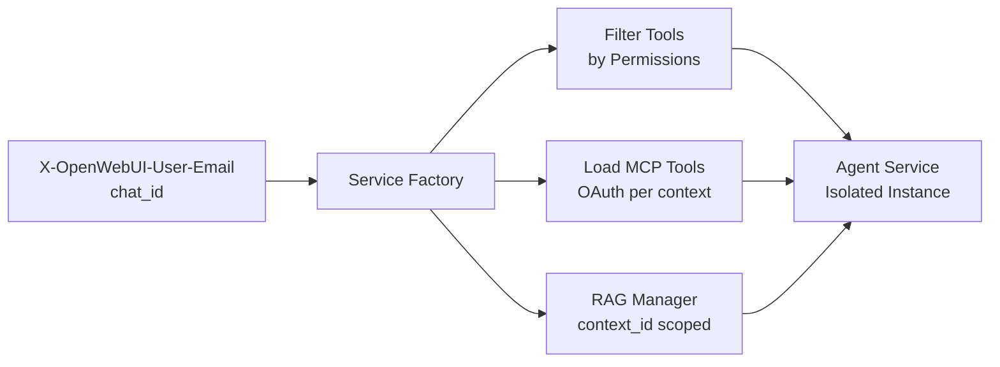

# Platform Architecture

This document provides a simplified view of the AI Agent Platform's architecture, showing how requests flow through the system.

## High-Level Architecture

The platform follows a **4-layer modular monolith**:



---

## Request Flow (Simplified)



---

## Agent Execution Pipeline

When the orchestrator routes to AGENTIC mode, the Agent Service runs this pipeline:



**Pipeline Components:**
1. **Planner Agent** - Generates structured execution plan
2. **Plan Supervisor** - Validates plan before execution
3. **Step Executor** - Runs individual steps (tools, skills, completions)
4. **Step Supervisor** - Reviews results, triggers replan if needed

---

## Core Components

| Component | Location | Purpose |
|-----------|----------|---------|
| **Unified Orchestrator** | `orchestrator/dispatcher.py` | Routes requests (CHAT vs AGENTIC) |
| **Agent Service** | `core/runtime/service.py` | Coordinates planning & execution |
| **Planner Agent** | `core/agents/planner.py` | Generates execution plans |
| **Step Executor** | `core/agents/executor.py` | Executes plan steps |
| **Step Supervisor** | `core/agents/supervisors.py` | Validates step results |
| **Skill Executor** | `core/skills/executor.py` | Runs skills with scoped tools |
| **Tool Registry** | `core/tools/registry.py` | Manages available tools |
| **RAG Manager** | `modules/rag/__init__.py` | Vector search (Qdrant) |
| **LiteLLM Client** | `core/runtime/litellm_client.py` | Multi-provider LLM interface |

---

## Runtime Decomposition

The Agent Service delegates specialized work to focused modules:



---

## Layer Dependency Rules

**Strict import hierarchy** enforced by architecture validator:

```
interfaces/     ──────┐
                      ├──> Can import
orchestrator/   ──────┤
                      │
modules/        ──────┤
                      ↓
core/           ←─────── NEVER imports upward
```

**Rules:**
- ✅ Interfaces can import orchestrator, modules, core
- ✅ Orchestrator can import modules, core
- ✅ Modules can import core
- ❌ Core NEVER imports modules, orchestrator, or interfaces
- ❌ Modules CANNOT import other modules (use Protocol-based DI)

---

## Multi-Tenant Context Isolation

Each user gets an isolated service instance:



**Isolation guarantees:**
- Tools filtered by context permissions
- OAuth tokens scoped to context_id
- Memory/RAG searches scoped to context_id
- Conversations scoped to context_id

---

## Event Streaming

The system streams typed events via SSE:

| Event Type | Description | Example |
|------------|-------------|---------|
| `thinking` | Internal reasoning | "Analyzing user request..." |
| `plan` | Generated execution plan | `{"steps": [...]}` |
| `step_start` | Step beginning | "Searching wiki..." |
| `tool_output` | Tool result | Search results |
| `skill_activity` | Skill worker status | "Fetching page..." |
| `content` | Final answer tokens | Response text |
| `error` | Error occurred | Exception details |

---

## File Structure

```
services/agent/src/
├── interfaces/          # Protocol adapters (HTTP, Telegram, Scheduler)
│   ├── http/
│   │   ├── app.py       # FastAPI application
│   │   ├── admin_*.py   # Admin portal modules
│   │   └── openwebui_adapter.py  # OpenAI-compatible API
│   ├── telegram/
│   └── scheduler/
├── orchestrator/
│   └── dispatcher.py    # Unified orchestrator (CHAT vs AGENTIC routing)
├── core/
│   ├── runtime/         # Agent service & infrastructure
│   │   ├── service.py           # Main coordinator
│   │   ├── persistence.py       # DB CRUD
│   │   ├── context_injector.py  # File/workspace injection
│   │   ├── tool_runner.py       # Tool execution
│   │   ├── hitl.py              # Human-in-the-loop
│   │   ├── litellm_client.py    # LLM client
│   │   └── memory.py            # Memory store
│   ├── agents/          # Agent pipeline components
│   │   ├── planner.py
│   │   ├── executor.py
│   │   └── supervisors.py
│   ├── skills/          # Skill execution
│   ├── tools/           # Tool implementations
│   ├── auth/            # Authentication & credentials
│   ├── db/              # Database models
│   └── observability/   # Tracing & metrics
└── modules/
    └── rag/             # RAG manager (Qdrant + embedder)
```

---

## Summary

**Key Architecture Principles:**

1. **4-layer modular monolith** - Clean separation of concerns
2. **Unified orchestrator** - Single entry point routes CHAT vs AGENTIC
3. **Agent pipeline** - Plan → Execute → Supervise with adaptive replanning
4. **Context isolation** - Multi-tenant with scoped tools, memory, and credentials
5. **Strict layer boundaries** - Core never imports upward
6. **Event streaming** - Real-time progress via typed SSE events

**Request Flow:**
```
User → HTTP Adapter → Unified Orchestrator → Agent Service → LLM
                              ↓
                         (or direct to LLM for simple CHAT)
```

The platform balances simplicity (direct LLM for simple questions) with power (full agentic pipeline for complex tasks requiring tools, planning, and supervision).
